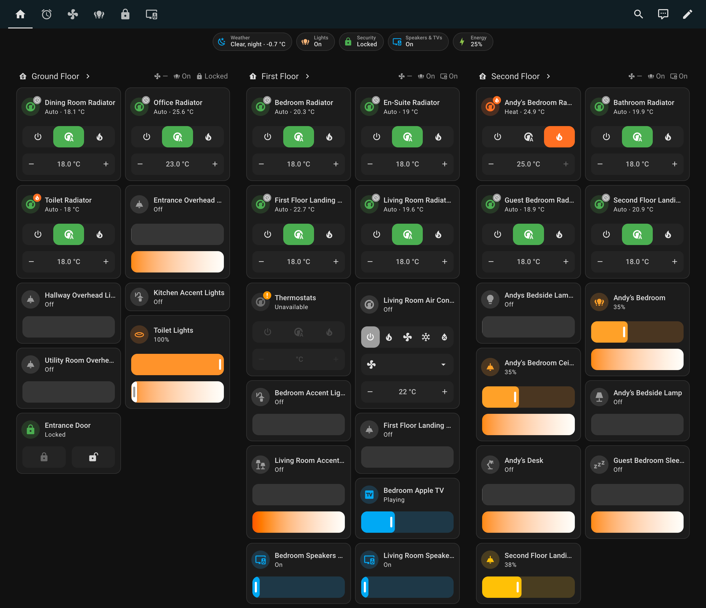

# Orchard UI

Orchard UI provides a set of custom strategies for Home Assistant dashboards. It supports various views, including home, floors, rooms, automations, lighting, and more, defined in the `strategies` folder.

