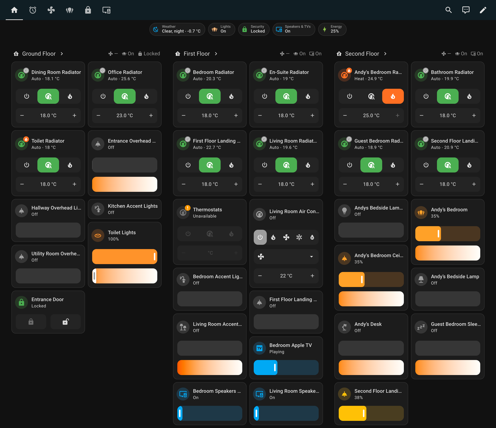

# Orchard UI Overview

Orchard UI provides custom Lovelace strategies that build dynamic Home Assistant dashboards.

## Features
- Ready-made layouts for homes, floors and rooms.
- Specialized views for devices such as lights, climate controls and media players.
- Flexible dashboard strategies for full homes or individual floors.

## Installation
1. Install dependencies with `yarn install`.
2. Create a development build using `yarn dev` or build the production bundle with `yarn build`.
3. [Install the plugin](./README.md#installing-in-home-assistant) in Home Assistant using your preferred method.

